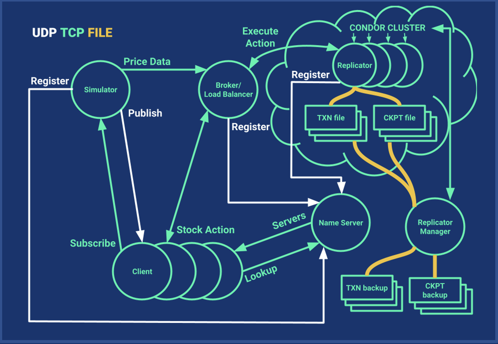
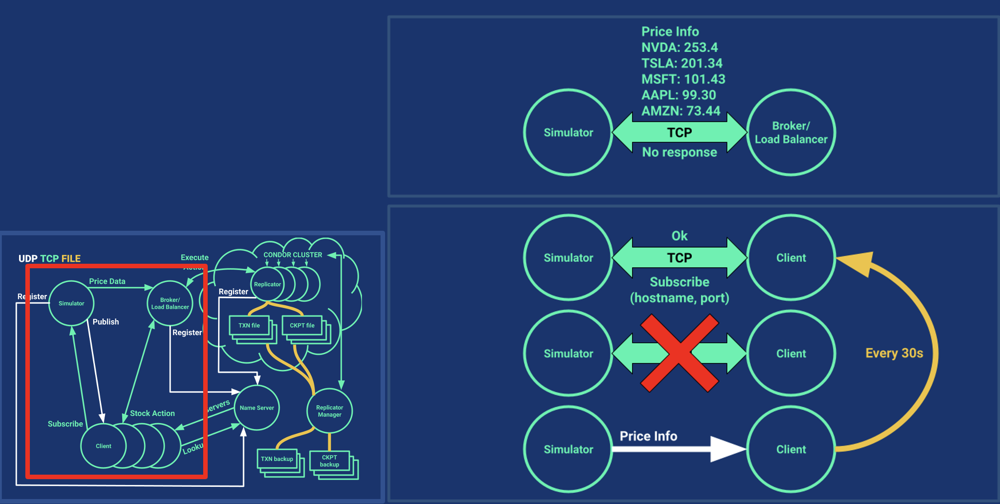
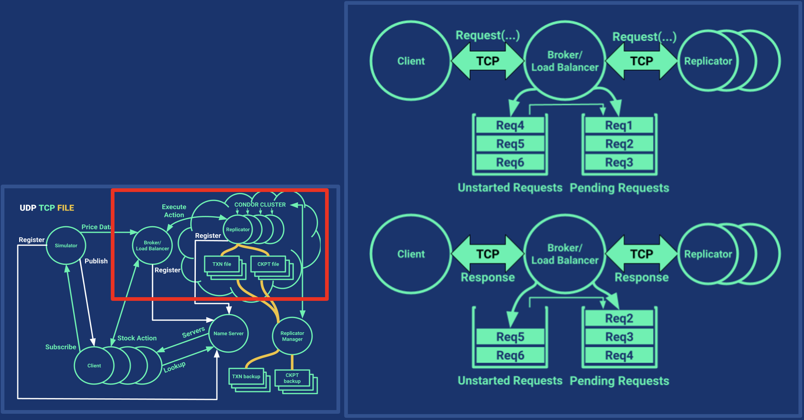
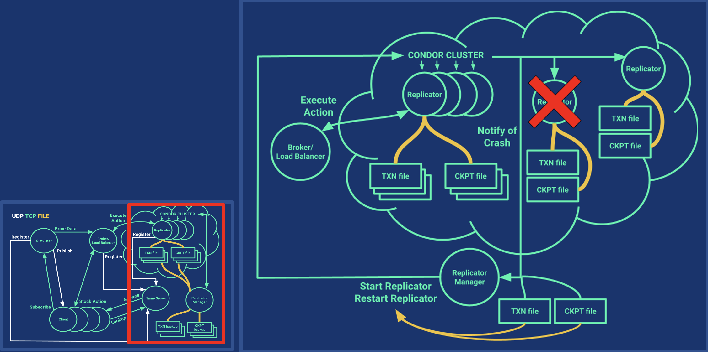
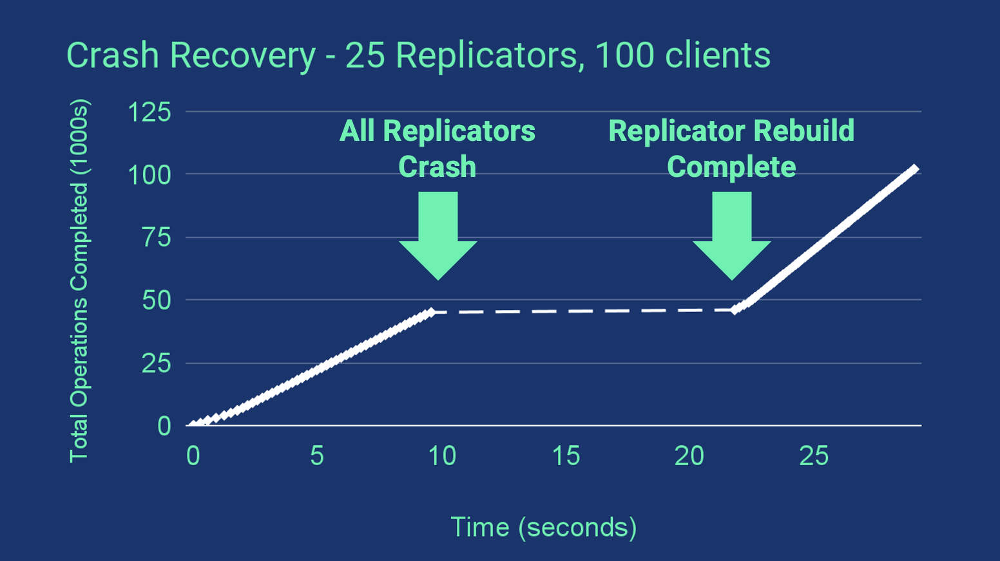
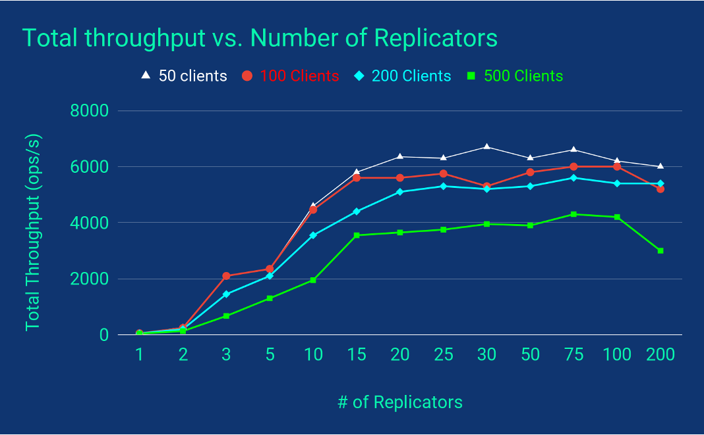
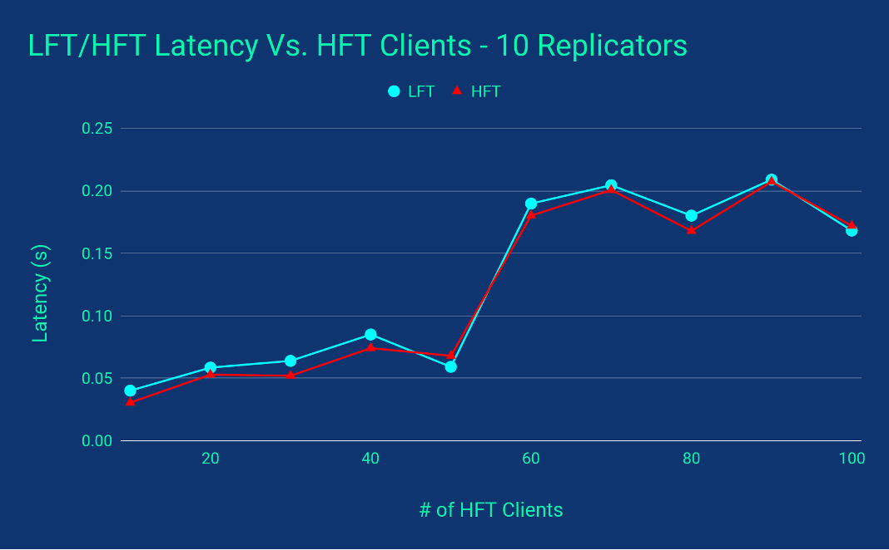
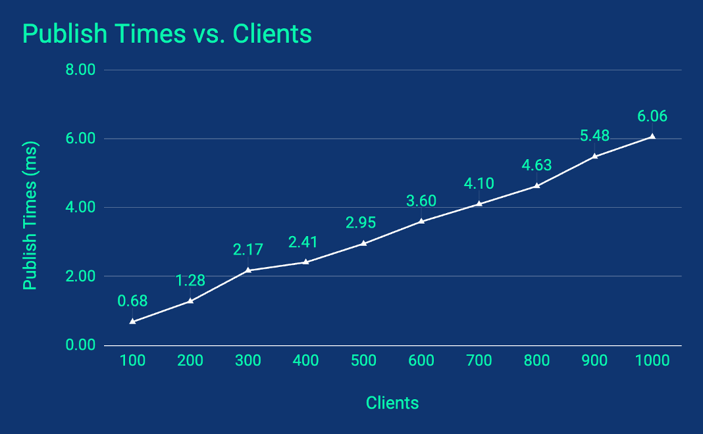
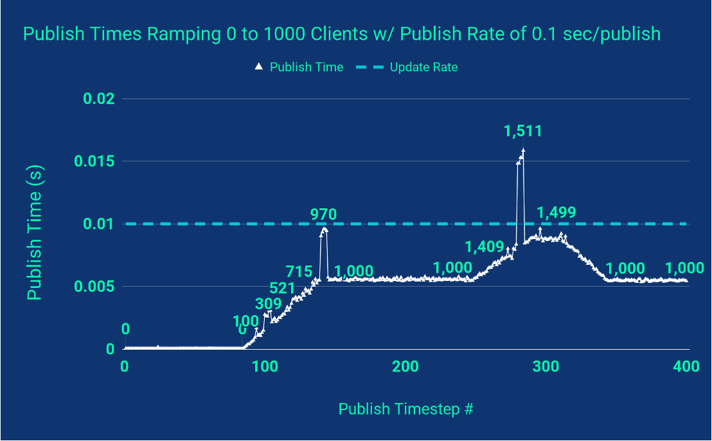

# StockNet, a Stock Market Simulation Game - Distributed Systems SP23 Final Project
by David Simonetti and John Lee

## General Description
We are trying to construct a large scale stock market simulation/game, where clients subscribe to an unreliable/delayed datastream and attempt to make optimal purchasing decisions on a basket of 5 stocks. Each client competes, not in a zero-sum game as in real markets, but for the top position on a global leaderboard.

Although finanicial markets actually move through a means of supply and demand, real market mechanics are beyond the scope of this project. Therefore, we make a series of assumptions for the market to simplify the problem.
- Every stock is implemented by taking minute data from actual markets from the last month, then using a random walk for that minute to emulate random market movement. General direction and variance are set to update such that the stock stays around a mean value.
- Each stock has infinite volume/liquidity, meaning that an individual's purchase does not impact the market in any way.
- Buy orders and sell orders are limited to fill orders, meaning they are priced at the immediate value of the stock, which will likely be different than the price reported through the data stream (the data is delayed).

To add interesting behavior to our system:
- The market is defined as a basket of 5 stocks
- The stock data may be delayed/out of order by an arbitrary amount of time or even not sent.


## Goals
We three main goals for our system:
1. Persistence/Consistency
    - A client should be able to disconnect and reconnect using the same account and continiue playing from where they left off
    - The broker should be able to recover, should it go down
2. Throughput
    - We wish to maximize the total operations per second fo all clients
3. Latency
    - In conjunction with maximizing throughput, we wish to minimize the latency of a single client's buy/sell operations
    - We wish to maintain fairness between low-frequency and high-frequency traders.


## Architecture

David can you fill this in

#### Overview



#### Simulator


#### Broker/Load Balancer


#### Replicator/Replication Manager



## Evaluation
We evaluted our system according to our 3 goals above:

#### Consistency
While we do not test the client-side (since our logging system should ensure that), we test what happens when our replication system crashes. In this plot, we observe that initially, our servers are servicing clients. At 10 seconds in, we crash all replicators and observe that no clients are being serviced. During this time, our replication manager goes through and restarts our replicators so that at ~23 seconds in all our clients can be serviced again.



#### Throughput
We test the total throughput of our system on 50, 100, 200, and 500 clients using a different number of replication servers. Initially, from 1-15 replication servers, the total throughput increases drastically for all clients. Then it starts leveling off. In an ideal system, we would only see this leveling off when the number of clients reaches the number of servers, since each server would begin handling more than 1 client. However, since we only have 1 load balancer, it is a source of bottleneck for our system.



#### Latency
We test the latency of both a high-frequency and low-frequency client. Overall, we observe that the latency goes up as the number of high-frequency clients increase, which is to be expected. We see a significant jump around 50-60 clients, which we suspect to be the point our load balancer becomes a bottleneck. For both HFT and LFT, the latency stays around the same, so our goal of fairness is met.



#### Simulator Publish Times
We wished to ensure that our simulator was not another source of bottleneck, we tested how long it would take in each publish interval to publish to an increasing number of clients. We observe that even with 1000 clients, the publish time is only 6ms, which is below our update rate of 10ms and the actual publish interval of 100ms. Thus, we could have more clients subscribe than our architecture can currently handle.



Furthermore, since we implement a pub/sub scheme that might result in temporarily duplicated clients, we observe the publish times over time. The data shows that the publish times do near the update rate, particularly with the two spikes (which we cannot explain besides performance hiccups). However, this is not a problem if we simply updated the data asynchronously.




## Running Code

To set up the environment, for every unique filesystem used, run the following commands
```
1. git clone https://github.com/David-Simonetti-ND/Stock-Market-Simulator.git (git@github.com:David-Simonetti-ND/Stock-Market-Simulator.git for ssh servers)
2. cd Stock-Market-Simulator/src
```

### Clients

There are several test scripts that can be used as a client.
1. `../../tests/test_hft.py` - a high-frequency trader that sends buy/sell requests as fast as possible (no stdout)
2. `../../tests/test_lft.py` - a low-frequency trader that sends buy/sell requests every 1 second (no stdout)
3. `../../tests/test_random_player.py` - a random LFT trader that randomly sends buy/sell requests of 1-15 stocks.
4. `../../tests/test_john_player.py` - a LFT trader that implements John's custom strategy
5. `../../tests/test_david_player.py` - a LFT trader that implements David's custom strategy
6. `../../tests/test_interactive.py` - an interactive trader for demonstration purposes


### Running on Student Machines:

Running on the student machines is the easiest to get an overview of all the parts of the system, but the performance is poor because the number of replicators will be limited to the number of machines that exist. Running multiple replicators on the same machine is possible but doesn't result in much throughput gain.

Ensure you have python 3.9+ installed on the student machines.

To run StockNet, start 4 different terminals connected to various student machines. They can be all the same student machine or all different.

From here, navigate to the Stock-Market-Simulator (wherever you cloned the github repository to) and `cd src` into the src directory on all four terminals.

#### Single Replicator (Basic)

On terminal 1, run the following command:
`python3 StockMarketSimulator.py <proj_name>`
- This will start the simulator on project name "stock". You can change the project name by changing the argument to the simulator.

On terminal 2, run the following command:
`python3 StockMarketBroker.py <proj_name> 1`
- This will create a broker on project name "stock" that is looking for 1 replicator to connect to. Make sure that the project names match for all of the servers.

On terminal 3, run the following command:
`python3 Replicator.py <proj_name> 0`
- This will create a replicator with an id of 0. Because the broker is only looking for 1 replicator, it will search for one with id 0 which is the replicator running on terminal 3.

On terminal 4 run the following command:
`python3 <path_to_test> <proj_name> <client_name>`
- `<path_to_test>` can be any of the clients mentioned in the Clients section.
- This will create a client with the name `<client_name>` and it will connect to the broker.


#### Multiple Replicators (Single Machine)
To play around with this further, there are a variety of options to change.

On terminal 3, one can instead run 
`python3 StartManyReplicators.py <proj_name> <n_servers>`
- This will start `<n_servers>` replicators all running on the same machine. Make sure to then restart the broker with an argument of 10 on the command line.

On terminal 2, the broker must be restarted using the same number of servers:
`python3 StockMarketBroker.py <proj_name> <n_servers>`
- This ensures the broker is now looking for `<n_servers>`

This will change the system so that now `<n_servers>` replicators are connected to the broker and sharing the load of client information. Now of course, they are all on the same machine so the throughput increase will be minimal. 

#### Multiple Replicators (Multiple Machines)
In addition, one could run many replicators on many different student machines to achieve the same effect.
For example, one could start the broker on student10 with
`python3 StockMarketBroker.py stock 2`

One could start one replicator on student11 with
`python3 Replicator.py stock 0`

And other replicator on student12 with
`python3 Replicator.py stock 1`

Because the broker is looking for 2 replicators, it is looking for replicators with names 0 and 1, which are started on student11 and student12 respectively.

#### Multiple Clients

For any of the configurations above, one could also increase the number of clients connected by running
`python3 StartManyClients.py stock <n_clients> <path_to_test>`
- This will create `<n_clients>` clients running the `<path_to_test>` program.
- `<path_to_test>` can be any path in the Clients section, except for the interactive client.

#### Crashing Servers

Once the system is up and running, any part of it can crash and it will recover successfully.
For example, once the system is up and running, one could go in and crash the broker, restart it, and the system will quickly pick right back up where it left off.
Clients can crash and reconnect, more clients can join, and clients can leave the simulation permenantly.
The only caveat is that the number of replicators is fixed for the given simulation run. Once the broker has a number of replicators specified, the whole system must be stopped in order to change that number.


### Running using Condor:

To run StockNet on condor, there are a couple of initialization steps to get it working.
First, clone this github repository somewhere in your `/scratch365/$USER/` directory.
Once there, navigate into the Stock-Market-Simulator directory and run the following command:
`conda env create --prefix /scratch365/$USER/stock_conda --file environment.yml`
This will create the prerequisite conda environment needed for the condor jobs to run.
The command might take some time to run (creating a conda environment can be pretty slow).

Once this is complete, you are ready to run StockNet with condor jobs!
In order to run the system, please open four different terminal windows.
Connect windows 1-2 to different CRC machines (for example, disc01 and disc02). 
Connect windows 3-4 to condorfe

On the first terminal window (disc01), navigate to the Stock-Market-Simulator directory (where you cloned the github repo)
Then cd into src, and run
`python3 StockMarketSimulator.py stock`
To run this and all of the following programs, you can use the conda environment created by conda up above, or any equivalent python3 (no dependencies required)
This will start the simulator on project name "stock". You can change the project name by changing the argument to the simulator.

On the second terminal (disc02), navigate to the Stock-Market-Simulator/src directory
Once there, run the following command
`python3 StockMarketBroker.py stock 10`
This will create a broker on project name "stock" that is looking for 10 replicators to connect to. Make sure that the project names match for all of the servers.

On the third terminal (condorfe), navigate to the Stock-Market-Simulator/src/condor directory.
Once there, run the following command
`python3 StartManyReplicatorsCondor.py stock 10`
This will start 10 condor jobs to run 1 replicator each. They will automatically connect to the broker when they are eventually scheduled to run.
In our testing, it can be up to 30s before the jobs begin running and connect to the broker. 

On the fourth terminal (condorfe), navigate to the Stock-Market-Simulator/src/condor directory.
Once there, run the following command
`python3 StartManyClientsCondor.py stock 10 ../../tests/test_hft.py`
This will start 10 condor jobs to each run 1 test_hft.py client program. After a short while, they should connect to the broker and begin trading.
Again, in our testing, it can be up to 30s before all clients are started and able to connect, so the broker might appear to be slow at first.

Once the system is working, the broker will start outputing throughput messages indicating how much requests it is able to serve.
One can crash any part of the system (simulator, broker, replicators, clients) and the system will eventually get back into a working state.
If one manually crashes the condor jobs, the replicator manager/client manager program will automatically restart them for you.
Otherwise, for the broker and simulator they have to be manually restarted if they are crashed.
Clients can be added and removed at will during the program execution. However, the number of replicators is fixed per run.
If one desires to change the number of replicators in the system, they must restart the simulation from scratch.

Once this is working, you can vary the number of clients/replicators and see the effect that it has on the system. 
Just ensure that the number of replicators started matches the number specified on the command line for the broker.

## Presentation
The powerpoint presentation summarizing our system and evaluation can be downloaded [here](results/StockNet%20Presentation.pptx).

## Final Paper
The final paper is located [here](None).